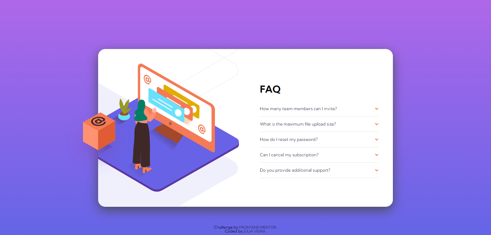

# Frontend Mentor - FAQ accordion card solution

This is a solution to the [FAQ accordion card challenge on Frontend Mentor](https://www.frontendmentor.io/challenges/faq-accordion-card-XlyjD0Oam). Frontend Mentor challenges help you improve your coding skills by building realistic projects. 

## Table of contents

- [Overview](#overview)
  - [The challenge](#the-challenge)
  - [Screenshot](#screenshot)
  - [Links](#links)
- [My process](#my-process)
  - [Built with](#built-with)
  - [What I learned](#what-i-learned)
  - [Useful resources](#useful-resources)
- [Author](#author)

## Overview

### The challenge

Users should be able to:

- View the optimal layout for the component depending on their device's screen size
- See hover states for all interactive elements on the page
- Hide/Show the answer to a question when the question is clicked

### Screenshot

### Links

- Challenge URL: [Front End Mentor](https://www.frontendmentor.io/challenges/faq-accordion-card-XlyjD0Oam)
- Solution URL: [Solution](https://github.com/Lia-Moon/FAQ-accordion-card) ** **This brings you back to this Github page**
- Live Site URL: [Live site](https://faq-accordion-card-three-vert.vercel.app/)

## My process

### Built with

- Semantic HTML5 markup
- CSS custom properties
- Flexbox
- CSS Grid

### What I learned

One of the things I learned was how to better use multiple classes on the same HTML element with Javascript.

## Author

- Website - [Júlia Vieira](https://juliavieira.xyz/)
- Frontend Mentor - [@Lia-Moon](https://www.frontendmentor.io/profile/Lia-Moon)
- Github - [@Lia-Moon](https://github.com/Lia-Moon)
